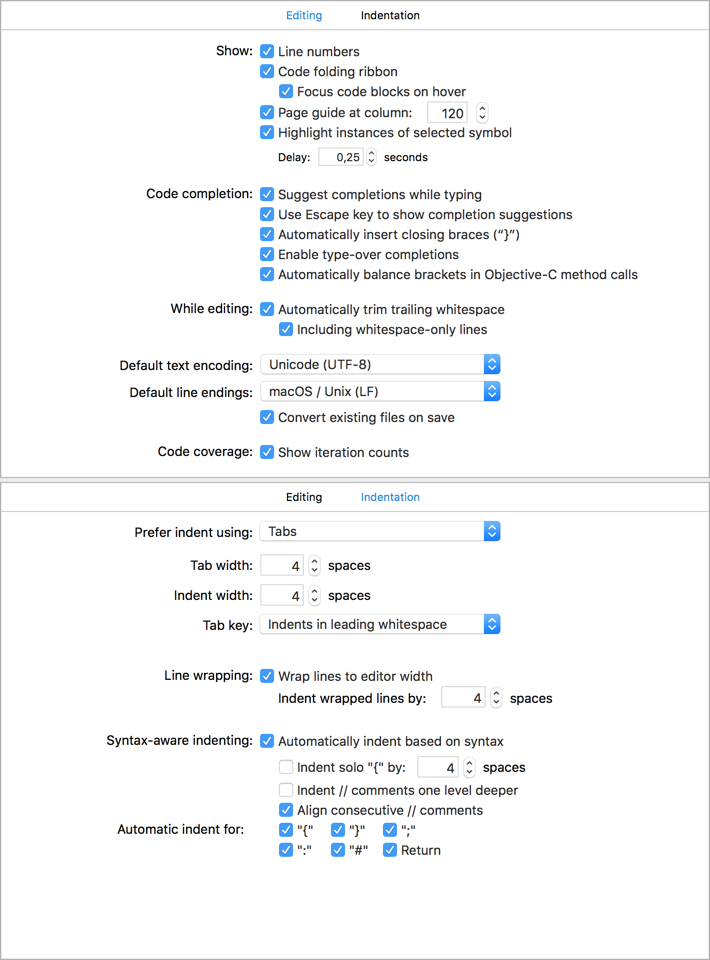

# Code Style

## Indentation

Tabs!

The only exception to this are files that are autogenerated (storyboard XML files, asset JSON files, ...)

## Swift

We pretty much stick to the [Ray Wenderlich Swift style guide](https://github.com/raywenderlich/swift-style-guide), except for indentation. We use tabs.

Any additional changes will be listed in this document.

## Xcode Text Editing settings

